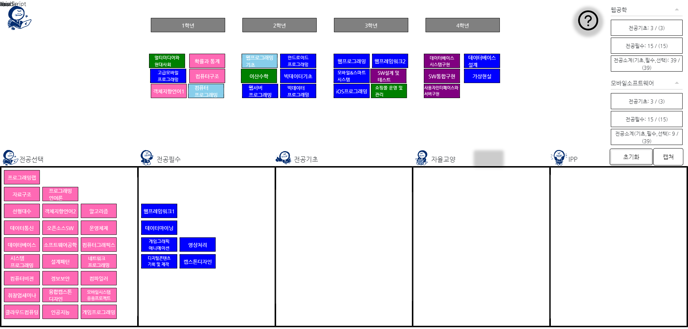

# 리액트 부시기 (8조)

### 주제 : 컴퓨터공학부 홈페이지 리뉴얼

- 팀장 : 1971166 남윤호
- 팀원 : 2171544 김강평, 2171238 서지원, 2191017 이다영

- 실행 방법 :

  1. npm install
  2. npm start

- 실행시 주의사항 :

  1. 로드맵 페이지에서 화면 비율이 맞지 않으면 축소하거나 확대해야 합니다.
  2. 아래와 같은 이미지의 비율로 맞춰야 정상작동 합니다. (초기화, 캡쳐 버튼이 IPP 박스에 닿기 바로 전의 비율)
     
